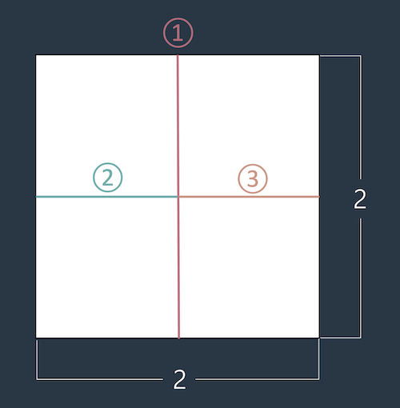

# 종이 자르기

문제 설명
머쓱이는 큰 종이를 1 x 1 크기로 자르려고 합니다. 예를 들어 2 x 2 크기의 종이를 1 x 1 크기로 자르려면 최소 가위질 세 번이 필요합니다.



정수 M, N이 매개변수로 주어질 때, M x N 크기의 종이를 최소로 가위질 해야하는 횟수를 return 하도록 solution 함수를 완성해보세요.

입출력 예
|M| N| result|
|---|---|---|
|2| 2| 3|
|2| 5| 9|
|1| 1| 0|

```js
function solution(M, N) {
  var answer = 0;
  return M * N - 1;
}

/* 풀이 
  핵심 -> 종이를 겹쳐서 자를 수 없습니다.
  겹쳐서 자를 수 없으니 결국은 한땀한땀 자를 수 밖에 없다. 아래와 같이 MxN 짜리 종이를 생각해보자.

  이걸 우선 가로방향으로 n개로 쪼개보자. 이 경우 n-1번 쪼개면 된다. 그리고 그 중 한 개만 세로방향으로 쪼개보자. m-1번 쪼개면 된다. 그런데, m-1번 쪼갠게 처음 n-1번 쪼갠 n개의 조각 하나이므로 총 n개의 조각을 m-1번 쪼개야 한다.

  따라서 처음에 가로로 쪼갠 경우, 답은 n-1 + n(m-1) 이 된다.
  그럼 처음에 세로로 쪼갠 경우는 어떻게 될까? m-1 + m(n-1)이 된다.
  근데 둘다 식을 풀어보면 전자는 n-1+nm-n = nm-1
  후자는 m-1+mn-m = nm-1 이다.

  따라서 어느쪽을 먼저 자르더라도 nm-1이 답임을 알 수 있다.
*/
```
